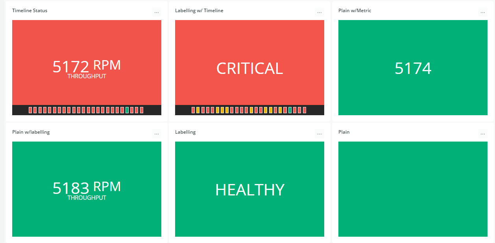
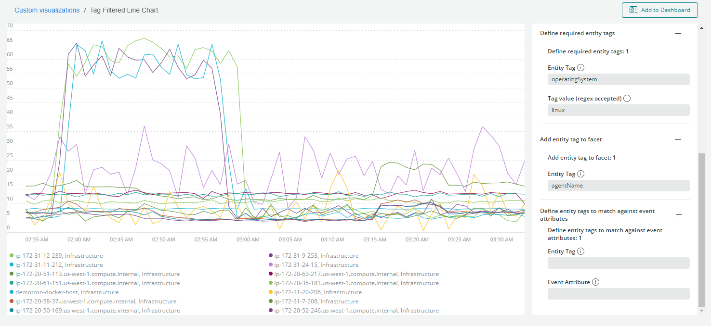

# New Relic Custom Visualizations

# Visualizations

### NRQL Status Widget (moved to https://github.com/newrelic-experimental/nr1-nrql-status-widget)


https://github.com/newrelic-experimental/nr1-nrql-status-widget

### Entity Tag filtered Line Chart

Features:

- Set required entity tags
- Add additional facets from entity tags
- Entity tag and event attribute bridging



## Getting started

Run the following scripts:

```
npm install
npm start
```

Visit https://one.newrelic.com/?nerdpacks=local and :sparkles:

## Dashboard deployment

https://developer.newrelic.com/build-apps/build-visualization#deploy-and-use-your-visualization

```
This needs to be deployed into your account so that the custom visualizations can be added to dashboards.
After this has been deployed, ensure you navigate to the app and add to the account.
```

## Documentation

https://developer.newrelic.com/build-apps/build-visualization#deploy-and-use-your-visualization

## Creating new artifacts

If you want to create new artifacts run the following command:

```
nr1 create
```

> Example: `nr1 create --type nerdlet --name my-nerdlet`.
